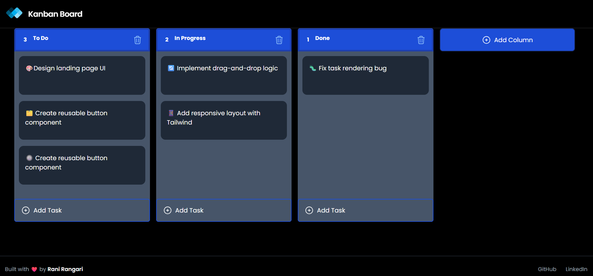
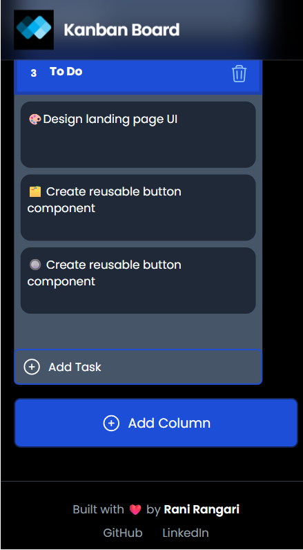

## 🗂️ TaskFlow – Interactive Kanban Board (React + Tailwind)  


A task management tool that helps visualize workflows using draggable columns and task cards — ideal for organizing personal projects or team sprints.  

---

## 🚀 Live Demo -  [Try it on Vercel](https://kanban-board-flowtask.vercel.app/) 

---

## 📚 About This Project  

Built shortly after completing CDAC, this project was a self-driven effort to deepen my understanding of React-based UI interactions, state management, and drag-and-drop workflows.

While simple in scope, it highlights several important frontend skills:  
- Implementing drag-and-drop using `react-beautiful-dnd`
- Structuring components with clean logic and layout
- Managing UI state and interactivity with `useState` & `useEffect`
- Styling with Tailwind CSS for a utility-first approach

> 🕒 Organized and published later for clarity, learning, and portfolio presentation.

---

## 🛠️ Tech Stack

- [React](https://reactjs.org/) : JavaScript library for building interactive UIs with reusable components. 
- [Tailwind CSS](https://tailwindcss.com/) : Utility-first framework for responsive design without writing custom CSS.

---

## 📸 Screenshots  

<div align="center">
  
  
</div>

---

## ✨ Features

- 🗂️ Create and organize tasks across multiple columns
- 🔄 Drag and drop tasks and columns to rearrange your workflow
- ➕ Add and remove tasks dynamically
- 📱 Mobile-friendly layout for easy access on any device
- ⚡ Smooth UI transitions and responsive interactions

---

## 🔄 What Came Next

This Kanban board project marked a key transition from frontend learning to building complete, real-world applications with deeper interactivity and structure.  

After this, I began building **full-stack applications** with **ReactJS** and **Spring Boot**, adding real API integrations, role-based auth, database persistence, and modular monolithic structures.

📌 **Explore my pinned GitHub repositories to see full-stack platforms built beyond the academic phase.**

---

## 📁 Folder Structure 

```
kanban-board/
├── public/
├── src/
│ ├── assets/        #logo image
│ ├── components/    #ColumnContainer, TaskCard etc  
│ ├── └── ui/        #badge, button etc
│ ├── └── icons/     #PlusIcon, TrashIcon
│ ├── └── pages/     
│ └── App.jsx
├── tailwind.config.js
└── package.json
```

---

## ⚙️ Setup Instructions

### 1. Clone the repository

```bash
git clone https://github.com/rangari-rani/academic-projects-cdac.git
cd kanban-board
```

### 2. Install Dependencies

```bash
npm install
```

### 3. Start the development server

```bash
npm run dev
```

> The app will be available at:  
> 🌐 http://localhost:5173

---

## ⚠️ Limitations  

- No data is saved after page refresh
- No login or user-specific access
- Tasks support only basic text, no labels or due dates

---

## 📜 License

[MIT License](LICENSE)

---

## 📬 Contact

Built as part of continued frontend exploration after CDAC (2024).     
📫 Connect with me on [LinkedIn – Rani Rangari](https://www.linkedin.com/in/rani-rangari/)   
⭐ If you found this project helpful or insightful, feel free to leave a ⭐!  
